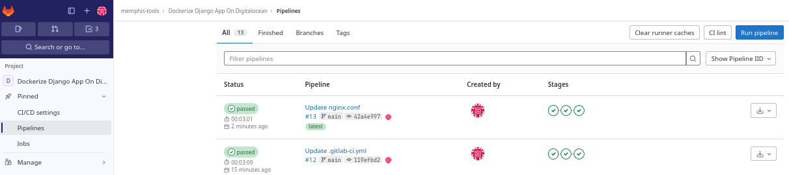
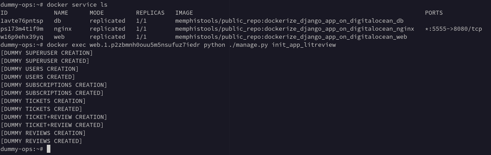
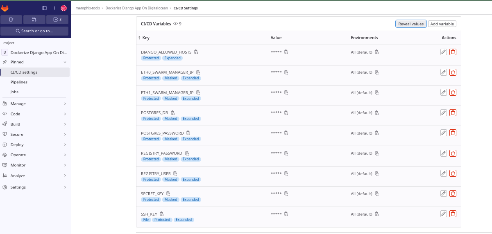
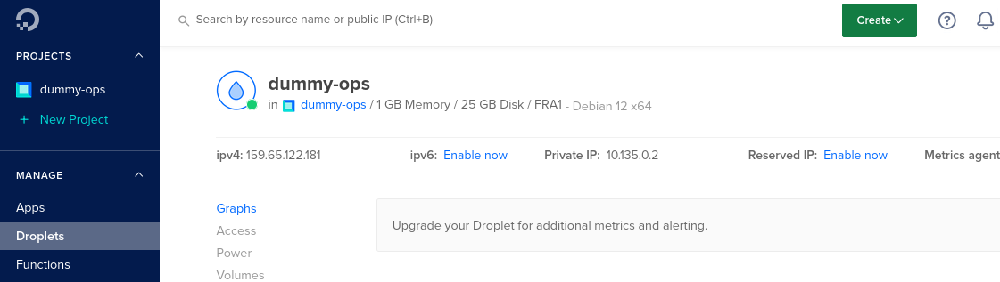

# Dockerize a dummy Django app

## Description

Last update: **2023/09/16**

Dummy Django application which simulates a micro social network where people publish or ask for literary criticisms.

**Learning purposes.**.

The application can be deployed on local containers through Compose.

It can be deploy on a cloud provider too, here DigitalOcean for the example, as a 1 node swarm cluster running 3 services (we use docker secrets).

The project is bind to Gitlab where a CI/CD "test, build, deploy" chain run.

Django particularity set: 'DJANGO_ALLOWED_HOSTS' is a coma separated string to declare host. Only 1 is used, the first one (see settings.py).

**Right now / Still waiting for update (for a secure efficient deployment on cloud)**:
  - no HTTPS, application is reached through HTTP on 5555 port.
  - docker secrets are set on the virtual machine manually before run the CI/CD chain. No vault or mount points.
  - docker secrets access is /are delivered for such path: /run/secrets/*. Problem is than it can be read by any one connected on the container.
  - initial deployment requires a manual terraform execution in order to publish on the cloud provider.
  - no dynamic IP /DNS detection or recognition: we create 3 containers /services successively, on the default Swarm network.
  - no dissociate deployment environments (1 context for development, 1 for production etc).
  - Gitlab project is create manually, not through API.
  - Gitlab environment variables are created manually.
  - Compose could be used, but here we have a Swarm and the DNS hosts are not set automatically. We force '/etc/hosts' update with the 'docker service create' directive '--host'.
  - no tests's thresholds controlled.
  - Docker daemon is not rootless.

## Technologies
Python 3

Postgresql 15 (driver psycopg 3)

Gunicorn

Nginx (nginxinc/nginx-unprivileged image)

Docker, DockerHub

Gitlab (the CI/CD chain is engaged throuh the Gitlab repo)

Terraform

## About it

Goal is to have a 'flexible and functional' Django's skeleton application that follows best practices. Ready to be run through containers.

## Documentation, sources

Notice we use the default 'postgres:15.0-alpine' image. **We do not update the 'pg_hba.conf' file**.

Nginx publish port 5555, but the local container use 8080 (default for nginxinc/nginx-unprivileged image).

Implementation of Docker secrets: [DOCKER SECRETS](https://docs.docker.com/engine/swarm/secrets/)

About CI/CD, the most reliable and precise i fund: [TECHWORLD WITH NANA](https://www.youtube.com/@TechWorldwithNana)

About Postgresql and Docker secrets (look at image official docs): [POSTGRESQL and DOCKER SECRETS](https://hub.docker.com/_/postgres)

About Django and Docker secrets. Don"t be fooled, Django vars expect a value, no usage of the "_FILE" suffix. [Django and a Docker secret example](https://en.ovcharov.me/2021/09/30/use-docker-secrets-in-django/)
      Note: if link breaks, just notice that you must not try to declare a "SECRET_KEY_FILE" for example, there is no such mechanism as you could observ for MYSQL or POSTGRESQL.

Other various links:

https://docs.docker.com/develop/security-best-practices/

https://docs.docker.com/develop/develop-images/dockerfile_best-practices/

https://docs.docker.com/engine/reference/commandline/service_create/

https://docs.docker.com/engine/security/rootless/

https://docs.docker.com/engine/swarm/secrets/

https://blog.stephane-robert.info/post/docker-secrets/

https://blog.gitguardian.com/hunting-for-secrets-in-docker-hub/

https://github.com/GitGuardian/ggshield

https://hub.docker.com/r/nginxinc/nginx-unprivileged

## How it works ?

Nginx is the front-end, runs as a proxy for Gunicorn. It allows to serve the 'static and media' files.

Django is served by Gunicorn. They both constitute a service.

Postgresql is the database back-end. It dialogues with Django.

## How use it ?

The common requirement should to have create a [DockerHub account](https://hub.docker.com/)

---

### Local deployment

You must have installed docker-compose.

Actually see the local deployment capability as a development environment. Here we set .env (not in the cloud deployment).

1. Clone the repository

      `git clone https://github.com/memphis-tools/dockerize_django_app_on_digitalocean.git`

      `cd dockerize_django_app_on_digitalocean`

2. Setup a virtualenv

      `python -m venv env`

      `source env/bin/activate`

      `pip install -U pip`

      `pip install -r requirements.txt`

3. Create a '.env' file in the app folder

File content:

      DEBUG=0
      SECRET_KEY='SuperSecretKeyToSetByYourself'
      DJANGO_ALLOWED_HOSTS='0.0.0.0'
      SQL_ENGINE=django.db.backends.postgresql
      SQL_DATABASE=oc_projet9
      SQL_USER=postgres
      SQL_PASSWORD=SuperPasswordToSetByYourself
      SQL_HOST=db
      SQL_PORT=5432
      POSTGRES_USER=postgres
      POSTGRES_PASSWORD=SuperPasswordToSetByYourself
      POSTGRES_DB=oc_projet9
      SUPERUSER_NAME=admin
      SUPERUSER_EMAIL=admin@somebluelake.fr

Then execute: "./docker-compose-local-deployment.sh"

Either you (re)initialize application: ./docker-compose-local-deployment.sh reset

Either you stop and restart application: ./docker-compose-local-deployment.sh reload

---

### Cloud deployment

You need a Gitlab and DigitalOcean account to perform the following.

As a learning purposes we have a simple iterating execution creation:

- Postgresql host is the first created with a default ip: 172.17.0.2
- Nginx host is the second created with a default ip: 172.17.0.3
- Web host (Gunicorn and Django) is the last one create, with a default ip: 172.17.0.4

#### Use terraform to create a 'droplet' on DigitalOcean

[Install Hashicorp's terraform](https://developer.hashicorp.com/terraform/tutorials/aws-get-started/install-cli)

Check the terraform/debian_with_docker.tf, we will create a minimal install from the France region.

You have a DigitalOcean account, then create a personal access token, and a ssh dedicated key-pair.

  Export your DigitalOcean personal access token:

  `export DO_PAT="dop_v1_2WhatADopSecretIsNotItAsLongItIs"`

  Initialize terraform:

  `[dockerize_django_app_on_digitalocean]$ terraform -chdir=terraform init`

  Create terraform plan:

  `[dockerize_django_app_on_digitalocean]$ terraform -chdir=terraform plan -var "do_token=${DO_PAT}" -var "pvt_key=[path to your private key]"`

  Execute the plan,

  `[dockerize_django_app_on_digitalocean]$ terraform -chdir=terraform apply -var "do_token=${DO_PAT}" -var "pvt_key=[path to your private key]" -auto-approve`

  Watch out the end of execution and because it succeeded, consult the following.

  `[dockerize_django_app_on_digitalocean]$ terraform -chdir=terraform state list`

  `[dockerize_django_app_on_digitalocean]$ terraform -chdir=terraform state show digitalocean_droplet.dummy-django-with-docker`

  Notice the ipv4_address and ipv4_address_private addresses. Source your ssh private key and login through ssh.

  `ssh root@PublicIpAddress`

  Touch 2 files (on the remote host after ssh connection succeeded):

  `[dockerize_django_app_on_digitalocean]$ touch oc_projet9_db_secret.txt`: copy /paste in it your POSTGRESQL_PASSWORD

  `[dockerize_django_app_on_digitalocean]$ touch oc_projet9_web_secret.txt`: copy /paste in it your Django SECRET_KEY

So you should be able to obtain the below arborescence and informations displayed (we set the 'droplet' name as 'dummy-ops') :

    `dummy-ops:~# pwd
    /root
    dummy-ops:~# ls -l
    total 12
    -rw-r--r-- 1 root root  11 Sep 14 20:01 oc_projet9_db_secret.txt
    -rw-r--r-- 1 root root  65 Sep 14 20:01 oc_projet9_web_secret.txt

    # notice: eth0's "159.65.122.181" is the public ipv4 address (manually declared on Gitlab as ETH0_SWARM_MANAGER_IP).
    The 5555 port is served through the published port of the Nginx service (set in the 'docker-compose.yml' file). Waiting for TLS the current port translation is *:5555->*:8080
    # notice: eth1's "10.135.0.2" is a private ipv4 address (manually declared on Gitlab as ETH1_SWARM_MANAGER_IP).

    dummy-ops:~# ip -br -4 a
    lo               UNKNOWN        127.0.0.1/8
    eth0             UP             159.65.122.181/20  << the public ipv4 address. So here we would have a http://159.65.122.181:5555 as index page
    eth1             UP             10.135.0.2/16      << The one used while publishing the Swarm (dummy-ops:~# docker swarm init --advertise-addr 10.135.0.2)
    docker0          DOWN           172.17.0.1/16

    dummy-ops:~# cat oc_projet9_db_secret.txt
    @pplepie94`

**Notice the bad pratice here**: i hardcode set 2 secrets plain texts, waiting to be set and used as secrets during the Gitlab CI/CD execution, whereas they could /should be removed after docker secret's creation.

Run a pipeline.

After the deployment, you add some dummy initial datas as users, text and pictures. Use your web.1 id:

    `dummy-ops:~# docker exec web.1.uqj7sxdugvyex93tr4tvkd8mr python ./manage.py init_app_litreview`

Open a browser, and log with one of the dummy user created with the init_app_litreview management command.

By the way, finally, you can destroy the 'droplet' the way you created it by running:

 `[dockerize_django_app_on_digitalocean]$ terraform -chdir=terraform plan -destroy -out=terraform.tfplan -var "do_token=${DO_PAT}" -var "pvt_key=[path to your private key]"`

 `[dockerize_django_app_on_digitalocean]$ terraform -chdir=terraform apply terraform.tfplan`

 

#### Setup the Gitlab project

You have to create the project on Gitlab directly or import it from Github.

Then declare the following **ENV variables in your Gitlab project**. These will be fully used at **test and build stages** (Gitlab CI/CD) only:

    DJANGO_ALLOWED_HOSTS, POSTGRES_DB, POSTGRES_PASSWORD,REGISTRY_USER, REGISTRY_PASSWORD, SSH_KEY, ETH0_SWARM_MANAGER_IP, ETH1_SWARM_MANAGER_IP

    REGISTRY_USER and REGISTRY_PASSWORD: Your DockerHub credentials

    SSH_KEY: the content of your private SSH key.

    ETH0_SWARM_MANAGER_IP: the public ip address which comes from the 'droplet' (virtual machine) created. The eth0 ipv4 address. Don't hardcode eth0 instead of ip (for Linux). In the example: 159.65.122.181.

    ETH1_SWARM_MANAGER_IP: the private ip address from the droplet. In the example: 10.135.0.2.

---

### Github actions: workflow

The ggshield python's package is not in the requirements.txt.

If you want to scan the 3 images used in this public project:

    memphistools/public_repo:dockerize_django_app_on_digitalocean_db

    memphistools/public_repo:dockerize_django_app_on_digitalocean_nginx

    memphistools/public_repo:dockerize_django_app_on_digitalocean_web

---

### About project usages

3 default accounts with publications will be created: **donald, daisy et loulou**. Password is **applepie94**.

An admin ("Django superuser") account is created too.
